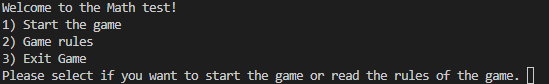
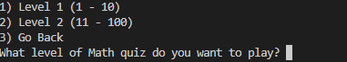
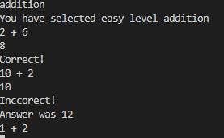

# Math-test

## About

This is a simple math test to test you'r math knowledge. The objective of this game is for the user to test him self 
how good the user is at the math.

## How to play

It's very simple how to play basically you just have to answer the math question. The user have the choyce what level he want to play(difficulty). Currently there is only 2 levels. In each level user can select what it want to do. User have 4 options division, subtract, 
addition, multiplication.

## Project Goals

- Play easy and fun game
- Read the rules of the game
- Be able to see if the answer is right or not if not what is the answer
- Ensure that the game is easy to understand
- Good for learning or just remmembering things

# Features

When starting game it says hello to the user and asks what you want to do.

If the user put wrong input that is non of the option then the games let's user know that he enterd
wrong input and then again asks again to enter difrent one.

If the user entered 1 then the game ask user again what level dos it want to play is it level 1 (easy, numbers between 1 - 10)
or level 2 (medium, numbers between 11 - 100)

When the user selected the level that it wants to play you get 4 options what you want to do in this level.
User has to enter the word what it wants to play one out of five (division, multiplication, subtract, addition or go back)

As it shows when the game is played in the addition, when the user types the it wants to play addition 
then the test starts. If it's answered correct then the game gives you Correct message but if the answer is 
wrong you will get Inccorect message and the right answer.

After the game user will see how many correct answers it answered out of how many and gives user 5 chooses
(restart game, go back to easy level, select difrent level, back to main menu or exit game).

# Bugs

## Solved bugs

- When doing division sometimes game showed to divide smaler number to a bigger number and the
answers were with remainder. fixed by adding if statement and % so there would be no remainders.
- Had an issue with the grammar when user had to type what it wanted but the game didn't recognise
the answer because the grammar was wrong.
- Subtraction was the same as division game was asking to subtract small number with a bigger so the 
answer would be negative. So I created if statement to check the numbers and put bigger one in the front.
- When playing the game and user enters not a number the game crash. Fixed by adding try and exept to catch str and put as error message.

## Remaining Bugs

- In the division game shows only few questions and at the end it show that is asked 10 questions.

# Future Plans

- Fix the bugs that left with a division and by not entering an number when playing.
- create hard mode for higher numbers

# Technologies Used

## Languages

- Python programming language for the logic of the program

# Frameworks & Tools

- Git was used for version control within VSCode to push the code to GitHub
- GitHub was used as a remote repository to store project code
- Heroku Platform was used to deploy the project into live environment
- PEP8 was used to check my code against Python conventions

# Validation

PEP8 Validation Service was used to check the code for PEP8 requirements. All the code passes.

# Manual Testing

- Checked if options in the main all are working (Start game, Game rules, Exit game)
- If the user selects start game then he will have 3 options which all of them are working
- After user selected then 5 options apear which user needs to type which option user wants 
- tested all options when user is playing game and what heppens when user types wrong answer
he will get message Incorect or if letter is typep it will say Please enter a number
- At the end of game user will be ask what it wants to do after the game

# Deployment

## Heroku

This application has been deployed from GitHub to Heroku by following the steps:

1. Create or log in to your account at heroku.com
2. Create a new app, add a unique app name (this project is named "Math-Test") and choose your region
3. Click on create app
4. Go to "Settings"
5. In Config Vars add a key 'PORT' and value '8000'.
6. Add required buildpacks. For this project, I set up 'Python' and 'node.js' in that order.
7. Go to "Deploy" and select "GitHub" in "Deployment method"
8. To link up our Heroku app to our Github repository code enter your repository name, click 'Search' and then 'Connect' when it shows below
9. Choose the branch you want to buid your app from
10. If prefered, click on "Enable Automatic Deploys", which keeps the app up to date with your GitHub repository or 
you can do it manualy by pressing "Deploy Branch"
11. Wait for the app to build. Once ready you will see the “App was successfully deployed” message and a 'View' button to take you to your deployed link.

# Credits

## Code

- [W3Scools](https://www.w3schools.com/) for ideas and inspiration.
- Code Institute for how to deploy to Heroku.

## Acknowledgements

- Code Institute community on Slack for resources and support.
- My Code Institute Mentor for feedback and suggestions.
